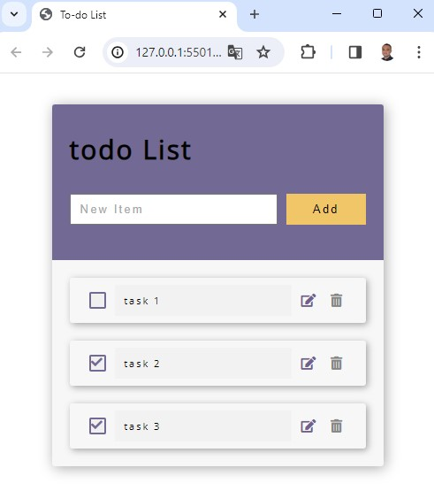

# To-Do List

## Goal

This is was an exercise made from the course [Curso de JavaScript Completo](https://www.udemy.com/course/javascript-completo-2018-do-iniciante-ao-mestre/?couponCode=GENAISALE24)

The goal to this exercise was receive a hmtl and css code from a to-do list page and perform the functioncionalties using DOM manipulation through javascript language and also saving the data into localStorage. 

To-do list is system where through its web page we can set, delete and edit tasks. Below is a screenshot of this project's web page

## Concepts learned

Through this mini project I could exercise properties and methods from document object, DOM elements, event object and localStorage object. Those properties and methods used in this project are listened bellow. 

### Document object

- document.createElement(htmlTag)

It creates an element node specified by the htmlTag parameter. 

### DOM elements

- element.className

  It sets the class attribute for an DOM element.

 - element.innerHTML 

The property innerHTML is used to set or get the HTML contained within the element. 

- element.textContent

The property textContent is used to set or get the text contained within the element. 

The essencial difference between innerHTML and textContent i that innerHTML doesn't consider formatting while textContent does. 

 - element.setAttribute(name, value)

   This methos is used to sets the value of an attribute on the specified element.
  
- element.appendChild(childElement)

- This method is used to append a node element as the last child of the specified element

element.addEventListener(type, function, useCapture)

This method attaches and event handler to a DOM element. The parameters are: 

type: A case-sensitive string representing the event type to listen for.

listener: The object that receives a notification (an object that implements the Event interface) when an event of the specified type occurs. Usually we use a function as the listener.

useCapture (optional): A boolean value indicating when events of this type will be dispatched 

false - The handler is executed in the bubbling phase.
true - The handler is executed in the capturing phase.

### Event object 

event.preventDefault()

The preventDefault() method cancels the event if it is cancelable, meaning that the default browser action that belongs to the event will not occur.

e.target.getAttribute
e.target.classList.contains

currentLi.remove()
currentLi.parentElement.removeChild(currentLi)

container.removeAttribute("style")

 currentLi.querySelector('.fa-check').classList.remove("displayNone")

 currentLi.querySelector('.fa-check').classList.add("displayNone")
